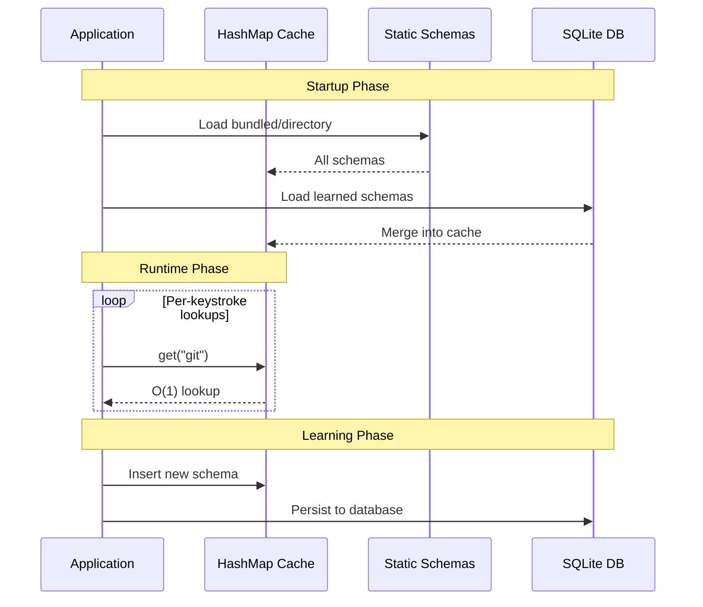

# command-schema

[](LICENSE)
[](https://www.rust-lang.org)

Parse CLI help text into structured schemas, then consume those schemas from JSON files, bundles, embedded data, or SQLite.

**Quick Links:** [Examples](examples/) | [CHANGELOG](CHANGELOG.md) | [Integration Guide](docs/integration-guide.md) | [Schema Contract](docs/schema-contract.md) | [Architecture Diagrams](#architecture)

---

## What is command-schema?

CLI tools expose their interface through `--help` text, but that text is unstructured and varies wildly across tools. **command-schema** parses help text from any CLI tool into a structured schema, then provides multiple storage and retrieval patterns so applications can consume those schemas at runtime.

- **Multi-strategy help text parsing** with confidence scoring (GNU, NPM, Clap, generic formats)
- **Pre-extracted schema database** available on the [`schemas`](https://github.com/ex1tium/command-schema/tree/schemas) branch
- **Multiple storage patterns**: directory, bundle, compile-time embedded, SQLite
- **O(1) in-memory lookups** via HashMap (~10M lookups/sec)
- **CI automation** for schema maintenance with version tracking and change detection
- **Production-ready** with comprehensive documentation and working examples


## Crates Overview

| Crate | Purpose | README |
| --- | --- | --- |
| `command-schema-core` | Core types, validation, merge utilities. Pure data layer with zero dependencies. | [core/README.md](core/README.md) |
| `command-schema-discovery` | Help-text parser with multi-strategy detection. Supports GNU, NPM, Clap, and generic formats. | [discovery/README.md](discovery/README.md) |
| `command-schema-db` | In-memory schema database with O(1) lookups. Supports directory, bundle, and compile-time embedding. | [db/README.md](db/README.md) |
| `command-schema-sqlite` | SQLite storage backend with normalized schema. Full CRUD operations and migration lifecycle. | [sqlite/README.md](sqlite/README.md) |
| `command-schema-cli` (`schema-discover`) | CLI tool for extraction, validation, bundling, and database management. | [cli/README.md](cli/README.md) |

**When to use**: `core` for type definitions, `discovery` for parsing, `db` for static lookups, `sqlite` for persistent storage, `cli` for automation.

---

## Quick Start

### Installation

Add as a git dependency (not yet published to crates.io):

```toml
[dependencies]
command-schema-db = { git = "https://github.com/ex1tium/command-schema" }
command-schema-discovery = { git = "https://github.com/ex1tium/command-schema" }
```

### Fetch the Schema Database

Pre-extracted schemas are maintained on a separate [`schemas`](https://github.com/ex1tium/command-schema/tree/schemas) branch and are **not** included on `main`. To use them locally:

```bash
# Fetch schemas into schemas/database/
make fetch-schemas

# Or manually:
git fetch origin schemas
mkdir -p schemas/database
git archive origin/schemas | tar -x -C schemas/database/
```

This populates `schemas/database/` which is used by directory loading, SQLite seeding, compile-time bundling, and most examples. The directory is gitignored on main.

### Parse Help Text

```rust
use command_schema_discovery::parse_help_text;

let help_text = r#"
Usage: mycli [OPTIONS] <COMMAND>

A fictional CLI tool for demonstration

Commands:
  init     Initialize a new project
  build    Build the project
  deploy   Deploy to production
  help     Print this message or the help of the given subcommand(s)

Options:
  -v, --verbose          Enable verbose output
  -q, --quiet            Suppress all output
  -c, --config <FILE>    Path to config file [default: config.toml]
      --no-color         Disable colored output
  -j, --jobs <N>         Number of parallel jobs [default: 4]
  -h, --help             Print help
  -V, --version          Print version
"#;

let result = parse_help_text("mycli", help_text);
if let Some(schema) = &result.schema {
    println!("Confidence: {:.2}", schema.confidence);
    println!("Subcommands: {}", schema.subcommands.len());
    println!("Global flags: {}", schema.global_flags.len());
}
```

See [examples/parse_help.rs](examples/parse_help.rs) for a full working example.

### Load Pre-extracted Schemas

After running `make fetch-schemas` (see above), load schemas into an in-memory database:

```rust
use command_schema_db::SchemaDatabase;

let db = SchemaDatabase::from_dir("schemas/database/")?;
if let Some(schema) = db.get("git") {
    println!("flags: {}", schema.global_flags.len());
}
```

See [examples/load_static_db.rs](examples/load_static_db.rs) for a full working example.

### Use SQLite Storage

Seed a SQLite database from the fetched schemas for persistent, queryable storage:

```rust
use command_schema_sqlite::{Migration, SchemaQuery};
use rusqlite::Connection;

let conn = Connection::open("schemas.db")?;
let mut migration = Migration::new(conn, "cs_")?;
migration.up()?;
migration.seed("schemas/database/")?;  // requires make fetch-schemas

let conn = migration.into_connection();
let mut query = SchemaQuery::new(conn, "cs_")?;
if let Some(schema) = query.get_schema("git")? {
    println!("Found git schema");
}
```

See [examples/sqlite_migration.rs](examples/sqlite_migration.rs) for CRUD operations and lifecycle management.

### Use the CLI

```bash
cargo run -p command-schema-cli -- parse-file --command git --input git-help.txt
cargo run -p command-schema-cli -- extract --installed-only --output ./schemas
```

---

## Integration Patterns

### Pattern 1: Simple Parsing

**Use case:** One-off help text parsing without storage.

```rust
use command_schema_discovery::parse_help_text;

let result = parse_help_text("git", &help_text);
if result.success {
    let schema = result.schema.unwrap();
    println!("{}: {} subcommands", schema.command, schema.subcommands.len());
}
```

- **Dependencies:** `command-schema-discovery`
- **Performance:** Parsing takes 10-50ms depending on help text complexity

### Pattern 2: Static Database

**Use case:** Read-only schema access for completion generators.

```rust
use command_schema_db::SchemaDatabase;

// Load from fetched schema directory (make fetch-schemas)
let db = SchemaDatabase::from_dir("schemas/database/")?;
if let Some(git) = db.get("git") {
    let push_flags = git.flags_for_subcommand("push");
    println!("git push flags: {}", push_flags.len());
}
```

- **Dependencies:** `command-schema-db`
- **Performance:** ~20-50ms startup, O(1) lookups (~10M/sec)
- **Setup:** Requires `make fetch-schemas` or your own extracted schemas

### Pattern 3: Zero-I/O Embedded

**Use case:** Performance-critical applications with compile-time embedding.

```rust
use command_schema_db::SchemaDatabase;

let db = SchemaDatabase::builder()
    .with_bundled()                    // Zero I/O, build-time embedded
    .from_dir("schemas/database/")     // Fallback to directory
    .build()?;
```

- **Dependencies:** `command-schema-db` with `bundled-schemas` feature
- **Performance:** ~5-15ms startup, +1-3MB binary size
- **Note:** Requires schemas in `schemas/database/` at build time (run `make fetch-schemas` first)

### Pattern 4: SQLite Storage

**Use case:** Persistent storage with runtime learning.

```rust
use command_schema_sqlite::{Migration, SchemaQuery};
use command_schema_core::{CommandSchema, SchemaSource};
use rusqlite::Connection;

let conn = Connection::open("schemas.db")?;
let mut migration = Migration::new(conn, "cs_")?;
migration.up()?;

let conn = migration.into_connection();
let mut query = SchemaQuery::new(conn, "cs_")?;

// Insert a schema learned at runtime
let schema = CommandSchema::new("mycli", SchemaSource::Learned);
query.insert_schema(&schema)?;
```

- **Dependencies:** `command-schema-sqlite`
- **Performance:** ~10-20ms startup, 1-5ms per query

### Pattern 5: Two-Tier Architecture (Recommended)

**Use case:** Terminal applications with fast lookups and persistent learning.

```rust
use command_schema_db::SchemaDatabase;
use command_schema_sqlite::{Migration, SchemaQuery};
use rusqlite::Connection;
use std::collections::HashMap;
use command_schema_core::{CommandSchema, SchemaSource};

// Tier 1: Load static schemas into memory
let static_db = SchemaDatabase::builder()
    .with_bundled()
    .from_dir("schemas/database/")
    .build()?;

// Tier 2: Initialize SQLite for persistence
let conn = Connection::open("learned.db")?;
let mut migration = Migration::new(conn, "cs_")?;
migration.up()?;
let conn = migration.into_connection();
let query = SchemaQuery::new(conn, "cs_")?;

// Merge static + learned into a single HashMap for O(1) lookups
let mut cache: HashMap<String, CommandSchema> = HashMap::new();
for name in static_db.commands() {
    if let Some(schema) = static_db.get(name) {
        cache.insert(name.to_string(), schema.clone());
    }
}
for schema in query.get_by_source(SchemaSource::Learned)? {
    cache.insert(schema.command.clone(), schema);
}
```

- **Dependencies:** `command-schema-db` + `command-schema-sqlite`
- **Performance:** ~100ms startup, O(1) lookups, persistent learning
- **Note:** This is the recommended pattern for production applications. See [examples/wrashpty_integration.rs](examples/wrashpty_integration.rs) for the complete `SchemaRegistry` implementation.



---

## Performance Characteristics

| Pattern | Startup Time | Memory Usage | I/O | Lookup Speed | Binary Size | Use Case |
|---------|--------------|--------------|-----|--------------|-------------|----------|
| **Directory** | 20-50ms | 2-5MB | Filesystem | O(1) ~10M/sec | Baseline | Development, Testing |
| **Bundle** | 10-30ms | 2-5MB | Single File | O(1) ~10M/sec | Baseline | Distribution |
| **Bundled** | 5-15ms | 2-5MB | None | O(1) ~10M/sec | +1-3MB | Production Apps |
| **SQLite** | 10-20ms | 2-5MB | Database | 1-5ms/query | Baseline | Persistent Storage |
| **Two-Tier** | ~100ms | 2-5MB | Both | O(1) ~10M/sec | Baseline | Terminal Apps |

- Target: <100ms startup, <10MB memory for 200+ schemas
- Lookup performance measured on modern hardware (2020+)

---

## Use Case Guidance

**When to use which crate/pattern:**

- **Shell completion generators** -> Use `command-schema-db` with directory or bundled loading
- **CLI testing frameworks** -> Use `command-schema-discovery` for parsing, `command-schema-db` for fixtures
- **AI/LLM integration** -> Use `command-schema-db` with `bundled-schemas` feature for zero-I/O
- **Terminal applications** -> Use two-tier architecture (Pattern 5) for fast lookups + learning
- **CI/CD pipelines** -> Use `command-schema-cli` for automated extraction and validation
- **Schema exploration** -> Use `command-schema-sqlite` for queryable storage

**Decision tree:**

- Need to parse help text? -> `command-schema-discovery`
- Need fast lookups? -> `command-schema-db`
- Need persistence? -> `command-schema-sqlite`
- Need both? -> Two-tier architecture
- Need automation? -> `command-schema-cli`

---

## Architecture

**Data flow:** Help text is parsed by `command-schema-discovery` into `CommandSchema` types defined in `command-schema-core`. Those schemas are stored and retrieved through `command-schema-db` (in-memory) or `command-schema-sqlite` (relational). The `command-schema-cli` binary orchestrates all crates for batch extraction, validation, and database management.

**Module organization:** Each crate has a focused responsibility and depends only on `command-schema-core` for shared types. `command-schema-sqlite` additionally depends on `command-schema-db` for seeding operations. The CLI depends on all crates to provide a unified interface.

For full architecture diagrams, see [Architecture Diagrams](#architecture).

---

## Examples

| Example | Description | Command | Needs Schemas? |
|---------|-------------|---------|:--------------:|
| `parse_help.rs` | Parse help text without executing commands | `cargo run -p command-schema-examples --example parse_help` | No |
| `load_static_db.rs` | Load schemas from directory | `cargo run -p command-schema-examples --example load_static_db` | Yes |
| `bundled_schemas.rs` | Zero-I/O embedded schemas | `cargo run -p command-schema-examples --example bundled_schemas --features bundled-schemas` | Yes (at build time) |
| `sqlite_migration.rs` | SQLite lifecycle and CRUD | `cargo run -p command-schema-examples --example sqlite_migration` | Yes |
| `wrashpty_integration.rs` | Two-tier architecture | `cargo run -p command-schema-examples --example wrashpty_integration` | Yes |

Run `make fetch-schemas` before running examples that need schemas. See [`examples/`](examples/) for source code.

---

## FAQ / Troubleshooting

**Q: How do I add a new command to the schema database?**
A: Add it to [`ci-config.yaml`](ci-config.yaml) and submit a PR. CI will automatically extract and publish it to the [`schemas`](https://github.com/ex1tium/command-schema/tree/schemas) branch. For local extraction, use `schema-discover extract --commands <command> --output schemas/database/`.

**Q: How do I customize the SQLite table prefix?**
A: Pass a custom prefix to `Migration::new(conn, "your_prefix_")` and `SchemaQuery::new(conn, "your_prefix_")`.

**Q: What if a command doesn't have --help?**
A: The parser tries multiple strategies (`--help`, `-h`, `help` subcommand). If none work, you can manually create a schema using the `command-schema-core` types.

**Q: How do I contribute schemas?**
A: Add commands to [`ci-config.yaml`](ci-config.yaml) and submit a PR. CI will automatically extract and validate them.

**Q: Why are my lookups slow?**
A: Ensure you're using the in-memory HashMap pattern (`SchemaDatabase`) for O(1) lookups. SQLite queries are slower (1-5ms) but still fast for most use cases.

**Q: How do I update schemas when commands change?**
A: CI runs weekly and on config changes, pushing updated schemas to the `schemas` branch automatically. Run `make fetch-schemas` to pull the latest. For local re-extraction, use `schema-discover ci-extract`.

**Q: Can I use this with non-Rust projects?**
A: Yes! The CLI tool (`schema-discover`) can be used standalone. Schemas are JSON files that any language can consume. See [`discovery/wrappers/`](discovery/wrappers/) for Node.js and Python clients.

---

## Contributing

**How to contribute:**

- **Add schemas**: Add commands to [`ci-config.yaml`](ci-config.yaml) and submit a PR
- **Improve parsers**: Enhance parsing strategies in [`discovery/src/parser/strategies/`](discovery/src/parser/strategies/)
- **Report issues**: Use GitHub issues for bugs or feature requests
- **Testing**: Run `cargo test` before submitting PRs
- **Documentation**: Update per-crate READMEs when changing APIs

**Development workflow:**

```bash
# Fetch the pre-extracted schema database
make fetch-schemas

# Run all tests
cargo test

# Run specific crate tests
cargo test -p command-schema-db

# Extract schemas locally
cargo run -p command-schema-cli -- extract --commands git,docker --output ./dev-schemas

# Run examples (most require make fetch-schemas first)
cargo run -p command-schema-examples --example parse_help
cargo run -p command-schema-examples --example load_static_db
```

**See also:**

- [CHANGELOG.md](CHANGELOG.md) for version history
- Per-crate READMEs for detailed API documentation
- [docs/integration-guide.md](docs/integration-guide.md) for integration patterns
- [docs/schema-contract.md](docs/schema-contract.md) for schema format specification

---

## License and Links

**License:** MIT (see [LICENSE](LICENSE))

**Documentation:**

- [Integration Guide](docs/integration-guide.md)
- [Schema Contract](docs/schema-contract.md)
- [CHANGELOG](CHANGELOG.md)

**Resources:**

- Pre-extracted schemas: [`schemas` branch](https://github.com/ex1tium/command-schema/tree/schemas) (fetch locally with `make fetch-schemas`)
- Schema JSON Schemas: [`schemas/json-schema/`](schemas/json-schema/)
- Runnable examples: [`examples/`](examples/)
- CI configuration: [`ci-config.yaml`](ci-config.yaml)

**Repository:** https://github.com/ex1tium/command-schema
